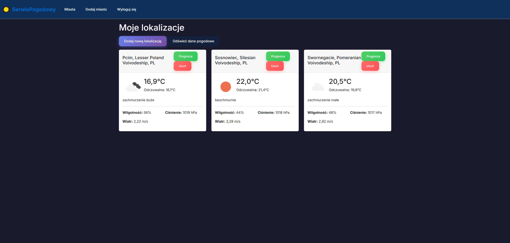
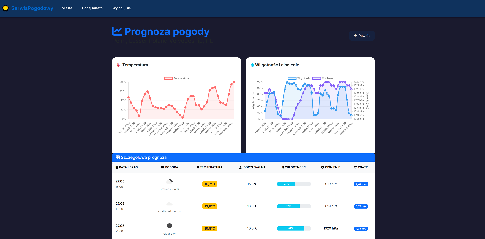

# 🌤️ Serwis Pogodowy

Aplikacja webowa do zarządzania lokalizacjami i przeglądania prognozy pogody, stworzona w ASP.NET Core MVC.

## 📋 Funkcjonalności

- **Rejestracja i logowanie użytkowników** z bezpiecznym hashowaniem haseł (SHA256)
- **Zarządzanie lokalizacjami** - dodawanie, usuwanie ulubionych miast
- **Aktualna pogoda** - temperatura, wilgotność, ciśnienie, prędkość wiatru
- **7-dniowa prognoza pogody** z interaktywnymi wykresami
- **Wyszukiwanie miast** z całego świata przy użyciu OpenWeatherMap API
- **Responsywny design** z nowoczesnym interfejsem

## 🛠️ Technologie

- **Backend**: ASP.NET Core MVC (.NET 9.0)
- **Frontend**: Bootstrap 5, Chart.js, FontAwesome
- **Baza danych**: SQL Server z Entity Framework Core
- **API pogodowe**: OpenWeatherMap API
- **Architektura**: Repository Pattern, Dependency Injection

## 📁 Struktura projektu

```
SerwisPogodowy/
├── 📁 Controllers/           # Kontrolery MVC i API
│   ├── 📁 Api/              # Kontrolery API (Swagger)
│   │   ├── CityApiController.cs
│   │   ├── HomeApiController.cs
│   │   └── UserApiController.cs
│   ├── CityController.cs     # Kontroler miast (MVC)
│   ├── HomeController.cs     # Kontroler główny
│   └── UserController.cs     # Kontroler użytkowników
├── 📁 Models/               # Modele danych
│   ├── 📁 ViewModels/       # Modele widoków
│   │   ├── CitySearchVM.cs
│   │   ├── CityWheaterInformationVM.cs
│   │   ├── UserLoginVM.cs
│   │   ├── UserRegisterVM.cs
│   │   ├── WheaterForecastVM.cs
│   │   └── WheaterVM.cs
│   ├── City.cs              # Model miasta
│   ├── User.cs              # Model użytkownika
│   ├── WeatherData.cs       # Model danych pogodowych
│   ├── SessionUser.cs       # Model sesji użytkownika
│   └── ErrorViewModel.cs    # Model błędów
├── 📁 Views/                # Widoki Razor
│   ├── 📁 City/             # Widoki miast
│   │   ├── Add.cshtml       # Dodawanie miasta
│   │   ├── Index.cshtml     # Lista miast
│   │   └── WeatherForecast.cshtml # Prognoza
│   ├── 📁 User/             # Widoki użytkownika
│   │   ├── LogIn.cshtml     # Logowanie
│   │   └── Register.cshtml  # Rejestracja
│   ├── 📁 Home/             # Widoki główne
│   └── 📁 Shared/           # Współdzielone widoki
├── 📁 Service/              # Warstwa serwisów
│   ├── CityService.cs       # Serwis miast
│   ├── UserService.cs       # Serwis użytkowników
│   ├── SessionService.cs    # Serwis sesji
│   └── I*.cs               # Interfejsy serwisów
├── 📁 Repositories/         # Warstwa dostępu do danych
│   ├── DataBaseRepository.cs # Repository bazy danych
│   ├── RemoteWeatherRepository.cs # Repository API pogodowego
│   └── I*.cs               # Interfejsy repositories
├── 📁 DataBase/            # Kontekst bazy danych
│   └── DataBaseContext.cs   # EF Core DbContext
├── 📁 wwwroot/             # Pliki statyczne
│   ├── 📁 css/             # Style CSS
│   ├── 📁 js/              # JavaScript
│   ├── 📁 lib/             # Biblioteki (Bootstrap, jQuery)
│   └── 📁 graphics/        # Obrazy i ikony
└── Program.cs              # Punkt wejścia aplikacji
```

## 🚀 Instalacja i uruchomienie

### Wymagania
- Visual Studio 2022 lub nowszy
- .NET 9.0 SDK
- SQL Server (LocalDB wystarczy)
- Klucz API OpenWeatherMap

### Kroki instalacji

1. **Sklonuj repozytorium**
   ```bash
   git clone [URL_REPOZYTORIUM]
   cd SerwisPogodowy
   ```

2. **Skonfiguruj bazę danych**
   - Otwórz `DataBase/DataBaseContext.cs`
   - Zmień `sqlServerName` na nazwę swojego serwera SQL
   ```csharp
   string sqlServerName = "TWOJA_NAZWA_SERWERA";
   ```

3. **Dodaj klucz API**
   - Zarejestruj się na [OpenWeatherMap](https://openweathermap.org/api)
   - W `appsettings.json` zamień klucz API:
   ```json
   "WeatherApi": {
     "ApiKey": "TWOJ_KLUCZ_API"
   }
   ```

4. **Utwórz bazę danych**
   ```bash
   dotnet ef database update
   ```

5. **Uruchom aplikację**
   ```bash
   dotnet run
   ```

Aplikacja będzie dostępna pod adresem: `https://localhost:7106`

## 📊 Zrzuty ekranu

### Strona główna z lokalizacjami


### Prognoza 7-dniowa


## 🔧 Konfiguracja

### Ustawienia API pogodowego
W pliku `appsettings.json`:
```json
{
  "WeatherApi": {
    "ApiKey": "twoj_klucz_api",
    "BaseUrl": "https://api.openweathermap.org",
    "CacheTimeoutMinutes": 180
  }
}
```

### Połączenie z bazą danych
```json
{
  "ConnectionStrings": {
    "DefaultConnection": "Server=NAZWA_SERWERA;Database=WeatherService;Trusted_Connection=true;TrustServerCertificate=true;"
  }
}
```

## 🗄️ Baza danych

### Tabele
- **Users** - dane użytkowników (email, hasło)
- **Cities** - zapisane lokalizacje użytkowników
- **WeatherData** - cache danych pogodowych

### Migracje
Aby dodać nową migrację:
```bash
dotnet ef migrations add NazwaMigracji
dotnet ef database update
```

## 🌐 API Usage

Aplikacja wykorzystuje OpenWeatherMap API:
- **Geolokalizacja**: `/geo/1.0/direct` - wyszukiwanie miast
- **Aktualna pogoda**: `/data/2.5/weather` - dane bieżące
- **Prognoza**: `/data/2.5/forecast` - prognoza 5-dniowa

## 🔒 Bezpieczeństwo

- Hasła są hashowane algorytmem SHA256
- Walidacja danych wejściowych na poziomie modelu
- Ochrona CSRF z AntiForgeryToken
- Walidacja sesji użytkownika

## 📝 Główne funkcje

### Rejestracja i logowanie
```csharp
// UserController.cs
[HttpPost]
public IActionResult LogIn(UserLoginVM model)
{
    if (userService.LogIn(model))
        return RedirectToAction("Index", "City");
    // ...
}
```

### Dodawanie miast
```csharp
// CityController.cs
[HttpPost]
public async Task<IActionResult> AddCity(City city)
{
    await cityService.AddCityAsync(city);
    return RedirectToAction("Index");
}
```

### Pobieranie prognozy
```csharp
// CityService.cs
public async Task<WheaterForecastVM> GetWeatherForWeekAsync(int cityId)
{
    // Logika cache i pobierania danych z API
}
```
